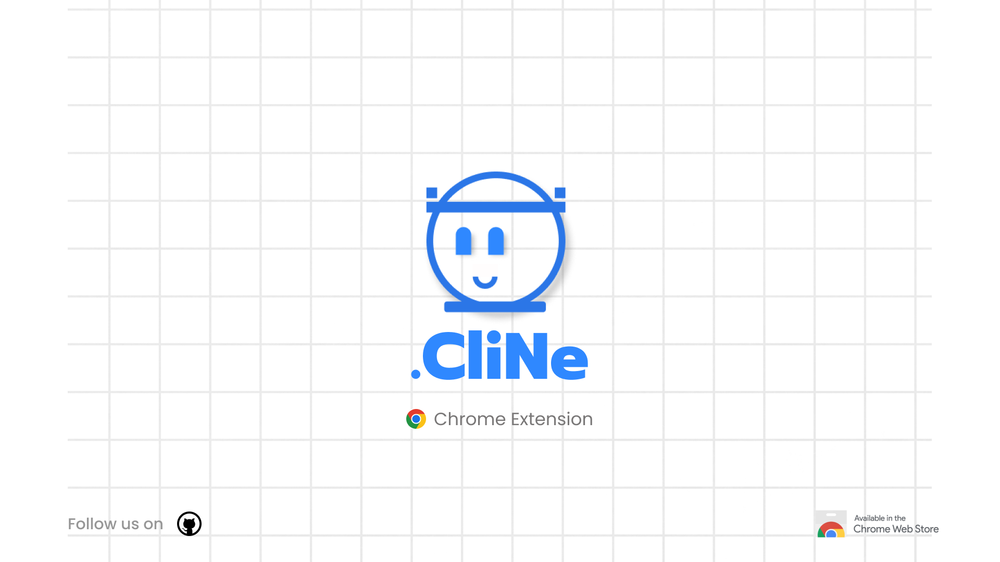

# 📌📌🤖CliNe.AI - Clickbait News Detector
Chrome Extension

CliNe is a Chrome extension and API that helps users identify clickbait news titles while browsing news websites. It utilizes natural language processing techniques to analyze news titles and provide real-time feedback on their clickbait nature.

## Project Overview
This project aims to combat the spread of clickbait news by providing users with a tool to identify potentially misleading titles. It consists of the following components:

- **Machine Learning**: The machine learning part involves training a deep learning model using LSTM (Long Short-Term Memory) architecture. The model is trained on a labeled dataset of clickbait and non-clickbait news titles, and it learns to recognize patterns and features that distinguish between the two categories.

By leveraging the power of machine learning, the CliNe project provides users with an effective tool to identify and avoid clickbait news titles, promoting more informed and reliable browsing experiences.

- **Chrome Extension**: A browser extension that integrates with Google Chrome and provides real-time clickbait detection while browsing news websites.

- **API**: A Python-based API that powers the clickbait detection functionality of the Chrome extension. It uses machine learning models to analyze news titles and classify them as clickbait or non-clickbait.

## Key Features
- Real-time clickbait detection while browsing news websites.
- Pop-up alerts for identified clickbait titles.
- Ability to report false positives or false negatives for continuous improvement.
- Local deployment of the API for users who want to run it on their own devices.

## Installation and Usage
To use CliNe, follow the instructions below:
Read **Installation guide** given in documentation and install it.
- [User Guide](/docs/CliNe_User%20Guide.pdf)

## Folder Structure
- [code](code) Main code for API and Chrome Extension.
- [data](data) Contains the dataset and word embeddings.
- [docs](docs) All the project-related documentations.
- [models](models) Contains the trained model and weights.
- [notebooks](notebooks) Includes Jupyter notebooks for data preparation, model training, etc.
- [resources](resources) Additional resources such as GloVe-word embeddings files.
- [results](results) Contains generated results such as accuracy and loss graphs, API test and final results etc.
- [UI-UX Design](ui-ux_design) Includes screenshots and wireframes showcasing the UI and design.

## Developers
- Janakar Patel - pateljankar124@gmail.com
- Abhi Prajapati - abhiprajapati011@gmail.com

## Contributing
We welcome contributions from the community. If you have any suggestions, bug reports, or feature requests, please submit them via the Issues section of this repository.

Contributions to CliNe.AI Chrome Extension are welcome and greatly appreciated!, please follow these steps:

- Fork the repository on GitHub.
- Create a new branch for your contribution.
- Make your changes and commit them to your branch.
- Submit a pull request to the main repository. Please ensure that your code adheres to the coding standards used in the project and includes tests where applicable. Also, be sure to provide a clear and detailed description of your changes in your pull request.

## License
This project is licensed under the [MIT License](LICENSE).

## Acknowledgements
We would like to express our gratitude to the creators of the GloVe word embeddings and the open-source libraries used in this project for their valuable contributions.

---
Thank you for using CliNe! We hope this tool helps you identify and avoid clickbait news titles while browsing the web.
